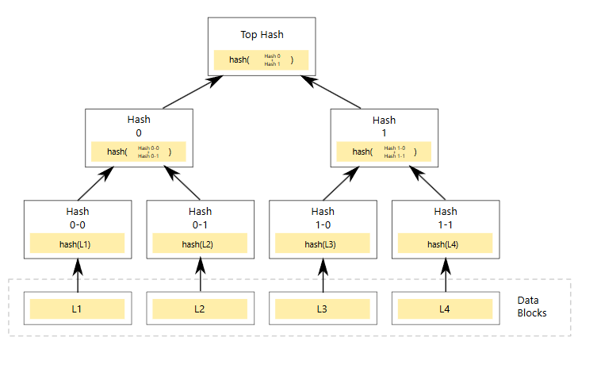
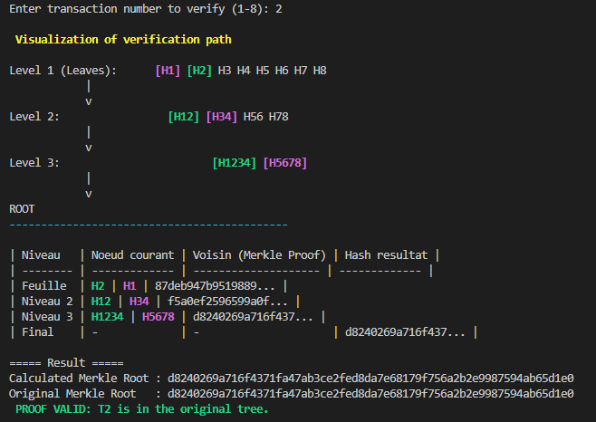
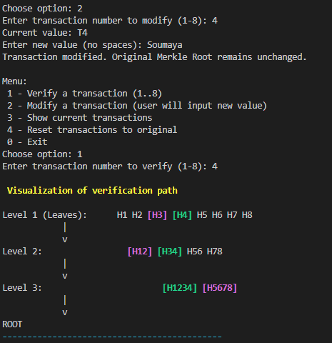
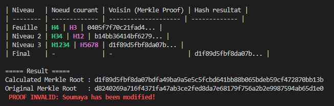

# 🧱 ATELIER 1 : Mini Blockchain en C++ – From Scratch

## 🎓 Master 2 Intelligence Artificielle et Science des Données (IASD)

**Étudiante :** Laakel Gauzi Soumaya

**Année universitaire :** 2025 / 2026

---

## 🧠 Introduction générale

Cet atelier a pour objectif de **concevoir une mini blockchain en C++** entièrement **from scratch**, en comprenant et codant :

* l’**arbre de Merkle** pour résumer les transactions,
* le **Proof of Work (PoW)** pour sécuriser les blocs,
* le **Proof of Stake (PoS)** comme alternative plus rapide,
* et la **mini-blockchain intégrée** combinant tous ces éléments.

Chaque exercice construit progressivement les composants essentiels d’une blockchain.

---

# 🌳 EXERCICE 1 – Arbre de Merkle




### 🎯 **Objectif**

L’objectif de cet exercice est d’implémenter **un arbre de Merkle basique en C++**, afin de :

* Calculer la **racine de Merkle (Merkle Root)** à partir d’un ensemble de transactions.
* Générer et vérifier une **preuve de Merkle (Merkle Proof)**.
* Tester la **validation** ou **l’invalidation** d’une transaction si elle est modifiée.

---

### ⚙️ **Principe**

Un **arbre de Merkle** est une structure arborescente utilisée pour vérifier l’intégrité d’un ensemble de données (comme les transactions d’un bloc dans la blockchain).

1. Chaque transaction est d’abord **hachée avec SHA-256**.
2. Les paires de hachages sont ensuite combinées et **rehachées** pour former le niveau supérieur.
3. Ce processus continue jusqu’à obtenir **un seul hachage** au sommet :
    **La racine de Merkle (Merkle Root)**.
4. Lorsqu’on veut vérifier une transaction, on utilise son **Merkle Proof**, c’est-à-dire le chemin de hachage reliant cette transaction à la racine.

   * Si la racine calculée à partir de la preuve est identique à la racine originale, la transaction est **valide**.
   * Sinon, elle a été **modifiée**.

---

### 🧠 **Exemple d’exécution**

#### 🔹 Cas 1 : Vérification d’une transaction inchangée

**Merkle Proof d'une transaction valide**



➡️ La transaction T2 est intacte, le hachage est cohérent avec la racine initiale.

---

#### 🔹 Cas 2 : Transaction modifiée

**Merkle Proof d'une transaction invalide**





➡️ La transaction T4 a été altérée, donc la racine calculée diffère de la racine originale.

---

### 🧩 **Résultat attendu**
* Possibilité de **vérifier** une transaction.
* Détection immédiate d’une **modification**.
* Maintien de la racine originale pour assurer la **traçabilité**.

---

# Exercice 2 — Proof of Work en C++

## 🎯 Objectif de l’exercice

L’objectif de cet exercice est d’**implémenter le mécanisme de Proof of Work (PoW)** au sein d’une **blockchain simplifiée** en langage **C++**.
Le principe consiste à trouver une valeur (`nonce`) telle que le **hash du bloc** commence par un certain nombre de zéros, selon la **difficulté** choisie.

---

## 🧩 Description technique

* Chaque bloc contient :

  * un **index**
  * le **hash du bloc précédent**
  * les **données du bloc**
  * un **timestamp**
  * un **nonce**
  * le **hash** calculé avec SHA-256
* Le **minage (mineBlock)** recherche le nonce approprié pour respecter la contrainte de difficulté.
* Le **temps d’exécution** du minage est mesuré pour chaque niveau de difficulté afin de comparer les performances.

---

## 🔍 Fonctionnement du Proof of Work

Le **Proof of Work** est un mécanisme de consensus qui demande à un nœud de résoudre un **problème cryptographique** (trouver un hash avec un certain nombre de zéros initiaux).
Ce travail de calcul :

* garantit que le bloc a nécessité un **effort réel** pour être ajouté à la blockchain,
* rend difficile la falsification des blocs,
* augmente la sécurité du réseau.

---

## 🧠 Étapes d’implémentation

1. Implémentation d’une **classe `Block`** contenant les informations d’un bloc et la méthode `mineBlock()`.
2. Implémentation d’une **classe `Blockchain`** gérant la chaîne et la création du **bloc genesis**.
3. Variation du **niveau de difficulté** (de 1 à 3) et mesure du **temps de validation** pour chaque niveau.
4. Vérification du **bon fonctionnement** à travers plusieurs exécutions.

---

## 🧪 Exemple d’exécution

```
==============================
>>> Test avec difficulte 1
==============================
Debut du minage du bloc 1 avec difficulte 1...

Bloc mine ! Nonce trouve: 49 | Hash final: 090d3092c0ac283232938667cdb784c7b9362ca6ce6d2e1e6080cbfa9dfee1a4

Temps de validation du bloc 1 : 0 ms

Index: 0
Hash: 1e3b067863bd024db2af8a36af57487d1454fc48b5bd38820fdbc4a4133f2c3b
Prev Hash: 0
Nonce: 0
-------------------------------
Index: 1
Hash: 090d3092c0ac283232938667cdb784c7b9362ca6ce6d2e1e6080cbfa9dfee1a4
Prev Hash: 1e3b067863bd024db2af8a36af57487d1454fc48b5bd38820fdbc4a4133f2c3b
Nonce: 49
-------------------------------

==============================
>>> Test avec difficulte 2
==============================
Debut du minage du bloc 1 avec difficulte 2...

Bloc mine ! Nonce trouve: 343 | Hash final: 00751bdbcc153a496464b716b6aacdedd290b01547de2948623b9a5af7ae1aa4

Temps de validation du bloc 1 : 4 ms

Index: 0
Hash: 1e3b067863bd024db2af8a36af57487d1454fc48b5bd38820fdbc4a4133f2c3b
Prev Hash: 0
Nonce: 0
-------------------------------
Index: 1
Hash: 00751bdbcc153a496464b716b6aacdedd290b01547de2948623b9a5af7ae1aa4
Prev Hash: 1e3b067863bd024db2af8a36af57487d1454fc48b5bd38820fdbc4a4133f2c3b
Nonce: 343
-------------------------------

==============================
>>> Test avec difficulte 3
==============================
Debut du minage du bloc 1 avec difficulte 3...
Nonce: 12000 | Hash: d991c71438d68d4da8bb7f7ca765d2e597df161b1ce39334a1a4e48d1a2911d0
Bloc mine ! Nonce trouve: 12737 | Hash final: 0007784c9f9d561b2386eacdba1fb7f223b9fa19e59c4b26c207d6f3ea562e1d

Temps de validation du bloc 1 : 177 ms

Index: 0
Hash: 1e3b067863bd024db2af8a36af57487d1454fc48b5bd38820fdbc4a4133f2c3b
Prev Hash: 0
Nonce: 0
-------------------------------
Index: 1
Hash: 0007784c9f9d561b2386eacdba1fb7f223b9fa19e59c4b26c207d6f3ea562e1d
Prev Hash: 1e3b067863bd024db2af8a36af57487d1454fc48b5bd38820fdbc4a4133f2c3b
Nonce: 12737
-------------------------------

```

---

## 📈 Interprétation des résultats

* Pour une **faible difficulté**, le temps de minage est **quasi instantané**.
* Lorsque la **difficulté augmente**, le **temps de calcul croît** de manière significative.
* Cela illustre le **principe fondamental du Proof of Work** : plus la difficulté est élevée, plus la preuve nécessite de puissance de calcul.

---

# Exercice 3 : Proof of Stake (PoS)

### 🧠 Objectif

L’objectif de cet exercice est d’implémenter une **blockchain simplifiée utilisant le consensus Proof of Stake (PoS)**, où les validateurs sont choisis en fonction du nombre de tokens qu’ils possèdent et mettent en jeu (*stake*).

L’approche PoS remplace la puissance de calcul (PoW) par une **sélection probabiliste équitable**, favorisant les utilisateurs ayant un plus grand engagement dans le réseau.

---

### 🧩 Fonctionnalités implémentées

* Définition d’un ensemble de **validateurs** (val1, val2, val3) avec leur **stake initial**.
* Sélection du **créateur du bloc** selon une probabilité proportionnelle à son stake.
* Attribution d’une **récompense** (reward) après chaque bloc validé.
* Calcul du **temps de validation** pour chaque bloc.
* Affichage du **stake mis à jour** et de la **blockchain finale**.

---

### 💻 Exemple d’exécution (résumé)

```
=== Bloc 1 ===
Probabilites selon le stake:
  val1: 50 tokens -> 50.00%
  val2: 30 tokens -> 30.00%
  val3: 20 tokens -> 20.00%
Tirage aleatoire (0-99): 33
-> Createur choisi: val1
Stake apres minage:
  val1: 60 tokens
  val2: 30 tokens
  val3: 20 tokens
 Temps de validation du bloc 1 : 16072 microsecondes
-----------------------------
=== Bloc 2 ===
Probabilites selon le stake:
  val1: 60 tokens -> 54.55%
  val2: 30 tokens -> 27.27%
  val3: 20 tokens -> 18.18%
Tirage aleatoire (0-109): 91
-> Createur choisi: val3
Stake apres minage:
  val1: 60 tokens
  val2: 30 tokens
  val3: 30 tokens
 Temps de validation du bloc 2 : 4424 microsecondes
-----------------------------
=== Bloc 3 ===
Probabilites selon le stake:
  val1: 60 tokens -> 50.00%
  val2: 30 tokens -> 25.00%
  val3: 30 tokens -> 25.00%
Tirage aleatoire (0-119): 93
-> Createur choisi: val3
Stake apres minage:
  val1: 60 tokens
  val2: 30 tokens
  val3: 40 tokens
 Temps de validation du bloc 3 : 11629 microsecondes
-----------------------------
=== Bloc 4 ===
Probabilites selon le stake:
  val1: 60 tokens -> 46.15%
  val2: 30 tokens -> 23.08%
  val3: 40 tokens -> 30.77%
Tirage aleatoire (0-129): 40
-> Createur choisi: val1
Stake apres minage:
  val1: 70 tokens
  val2: 30 tokens
  val3: 40 tokens
 Temps de validation du bloc 4 : 7323 microsecondes
-----------------------------
=== Bloc 5 ===
Probabilites selon le stake:
  val1: 70 tokens -> 50.00%
  val2: 30 tokens -> 21.43%
  val3: 40 tokens -> 28.57%
Tirage aleatoire (0-139): 6
-> Createur choisi: val1
Stake apres minage:
  val1: 80 tokens
  val2: 30 tokens
  val3: 40 tokens
 Temps de validation du bloc 5 : 8559 microsecondes
-----------------------------

Blockchain finale :
Index: 0 | Createur: Genesis | Hash: 0_Genesis_hash_0 | Prev Hash: 0 | Recompense: 0 tokens
Index: 1 | Createur: val1 | Hash: 0_Genesis_hash_0_val1_hash_1 | Prev Hash: 0_Genesis_hash_0 | Recompense: 10 tokens
Index: 2 | Createur: val3 | Hash: 0_Genesis_hash_0_val1_hash_1_val3_hash_2 | Prev Hash: 0_Genesis_hash_0_val1_hash_1 | Recompense: 10 tokens
Index: 3 | Createur: val3 | Hash: 0_Genesis_hash_0_val1_hash_1_val3_hash_2_val3_hash_3 | Prev Hash: 0_Genesis_hash_0_val1_hash_1_val3_hash_2 | Recompense: 10 tokens
Index: 4 | Createur: val1 | Hash: 0_Genesis_hash_0_val1_hash_1_val3_hash_2_val3_hash_3_val1_hash_4 | Prev Hash: 0_Genesis_hash_0_val1_hash_1_val3_hash_2_val3_hash_3 | Recompense: 10 tokens
Index: 5 | Createur: val1 | Hash: 0_Genesis_hash_0_val1_hash_1_val3_hash_2_val3_hash_3_val1_hash_4_val1_hash_5 | Prev Hash: 0_Genesis_hash_0_val1_hash_1_val3_hash_2_val3_hash_3_val1_hash_4 | Recompense: 10 tokens
-----------------------------

```

### ⏱️ Résultat final

* La blockchain contient 5 blocs.
* Le temps de validation est de quelques microsecondes.
* Comparée à la méthode **Proof of Work**, **Proof of Stake est beaucoup plus rapide** car il ne nécessite pas de calculs intensifs (pas de recherche de nonce).

---

## 📊 Comparaison PoW vs PoS

| Critère                  | Proof of Work (PoW)                               | Proof of Stake (PoS)                      |
| ------------------------ | ------------------------------------------------- | ----------------------------------------- |
| Principe                 | Résolution d’un problème cryptographique (minage) | Sélection aléatoire pondérée par le stake |
| Ressources nécessaires   | Forte puissance de calcul                         | Très faible (quasi instantané)            |
| Temps de validation      | Millisecondes à secondes                          | Microsecondes                             |
| Consommation énergétique | Élevée                                            | Faible                                    |
| Avantage principal       | Sécurité par la difficulté du minage              | Rapidité et efficacité énergétique        |

---


# 🧱  Exercice 4 : Mini Blockchain from Scratch

## 🎯 Objectif

Cet exercice a pour but d’intégrer **tous les éléments fondamentaux d’une blockchain** étudiés dans les exercices précédents (Merkle Tree, Proof of Work, Proof of Stake) pour construire une **mini blockchain fonctionnelle en C++**.

L’objectif est de :

* Comprendre la structure d’un bloc et d’une blockchain.
* Implémenter le **Proof of Work (PoW)** pour sécuriser un bloc.
* Implémenter le **Proof of Stake (PoS)** comme alternative rapide au minage.
* Comparer les performances des deux approches.

---

## ⚙️ Fonctionnalités implémentées

### 🧱 1. Structure de la Blockchain

Le programme comprend plusieurs classes :

* **Transaction** : représente une opération entre un expéditeur et un destinataire.
* **MerkleTree** : calcule la racine de Merkle pour résumer les transactions.
* **Block** : contient les informations du bloc (hash, Merkle Root, timestamp, etc.).
* **Blockchain** : gère la chaîne, l’ajout et la validation des blocs.

---

### 🔐 2. Proof of Work (PoW)

Le **PoW** est un mécanisme de consensus qui demande de **miner** un bloc en trouvant un hash commençant par un certain nombre de zéros (`difficulty`).

* Fonction principale : `mineBlock(int difficulty)`
* Mesure du temps de minage pour différentes difficultés.
* Simulation du coût en ressources.

---

### ⚡ 3. Proof of Stake (PoS)

Le **PoS** choisit un validateur en fonction de son "stake" (mise).

* Sélection pseudo-aléatoire pondérée par le stake.
* Validation rapide sans minage.
* Simulation du gain de temps et du coût réduit.

---

### 📊 4. Analyse comparative

Le programme affiche :

* Le temps moyen d’ajout d’un bloc pour PoW et PoS.
* Le nombre d’itérations et la consommation estimée.
* Les avantages et inconvénients des deux méthodes.

---

## 🧠 Concepts utilisés

| Composant             | Description                                     |
| --------------------- | ----------------------------------------------- |
| **SHA-256 (OpenSSL)** | Pour le hachage des données                     |
| **Merkle Tree**       | Structure d’arbre pour résumer les transactions |
| **Nonce**             | Valeur modifiée lors du minage (PoW)            |
| **Validator**         | Nœud sélectionné dans le PoS                    |
| **Timestamp**         | Date et heure de création du bloc               |
| **Reward System**     | Récompense des mineurs ou validateurs           |

---


## 📈 Exemple de sortie attendue

```
=================================================
         MINI BLOCKCHAIN FROM SCRATCH
=================================================

PoW_Chain initialized with Genesis Block!
Validators initialized with total stake: 450 tokens
  Mining Block 1 with difficulty 3...
  Block mined! Nonce: 2967 | Hash: 0005e87365e3b61a26a29496a4b33f432905dfd98fcd85f83058f99c7b6fd8c5
  Mining time: 68 ms | Iterations: 2967

  Block 1 added via PoW
  Mining Block 2 with difficulty 3...
  Block mined! Nonce: 3948 | Hash: 000d0d03a10f4ed6f8012181eb1ac82e2e2a6fd51ddaf550ef1e64cafd68e84d
  Mining time: 61 ms | Iterations: 3948

  Block 2 added via PoW
  Mining Block 3 with difficulty 3...
  Block mined! Nonce: 1310 | Hash: 0001377d99b8fd5d5114da7f626f2cac1b2db17d4f18e7f784dabc4f2b8a7123
  Mining time: 20 ms | Iterations: 1310

  Block 3 added via PoW

PoW_Chain STATISTICS:
  Total Blocks: 4
  Total Transactions: 10
  Chain Difficulty: 3
  Total Validators: 3

Validating PoW_Chain...
PoW_Chain is valid! (4 blocks)
PoS_Chain initialized with Genesis Block!
Validators initialized with total stake: 5700 tokens
  Block 1 validated by: Validator_A (Time: 14 ╬╝s)

  Block 1 added via PoS
  Block 2 validated by: Validator_D (Time: 14 ╬╝s)

  Block 2 added via PoS
  Block 3 validated by: Validator_A (Time: 14 ╬╝s)

  Block 3 added via PoS

PoS_Chain STATISTICS:
  Total Blocks: 4
  Total Transactions: 10
  Chain Difficulty: 2
  Total Validators: 4

CURRENT STAKES DISTRIBUTION:
----------------------------------------------------------
      Validator       Stake Percentage
----------------------------------------------------------
    Validator_A        1030      17.93%
    Validator_B     2000.00      34.81%
    Validator_C     1500.00      26.11%
    Validator_D     1215.00      21.15%
----------------------------------------------------------
Total Stake: 5745.00 tokens

Validating PoS_Chain...
PoS_Chain is valid! (4 blocks)


 PARTIE 4: ANALYSE COMPARATIVE
===============================
Metric                 | Proof of Work        | Proof of Stake
--------------------------------------------------------------
Total Time (ms)        | 162.206800 [====================] | 5.842800 [                    ]
Blocks Added           | 3                    | 3
Speed per Block (ms)   | 54.07                | 1.95
Energy Consumption     | High                 | Low
Decentralization       | Good                 | Limited
--------------------------------------------------------------


 AFFICHAGE DETAILLE DES CHAINES:
=================================

Press Enter to view PoW Chain details...

PoW_Chain - BLOCKCHAIN (4 blocks)
============================================================
------------------------------------------------------------
  BLOCK 0
  Hash: d57d5ad37fa70622c2f5384b9558fb3f...
  Previous: 0...
  Merkle Root: 7446bd042f1528c7ad44997d...
  Transactions: 1 | Nonce: 0
  Reward: 0.00 tokens
------------------------------------------------------------
  Transactions details:
 From  system to founder : 1000.00 tokens   | ID: e4c50104400e4530...

------------------------------------------------------------
  BLOCK 1
  Hash: 0005e87365e3b61a26a29496a4b33f43...
  Previous: d57d5ad37fa70622c2f5384b...
  Merkle Root: dc8ea2e25bc4e6c9ce35632c...
  Transactions: 3 | Nonce: 2967
  Reward: 12.50 tokens
------------------------------------------------------------
  Transactions details:
 From  sen1 to rec1 : 50.50 tokens   | ID: 23e7d585950a80d7...
 From  sen2 to rec2 : 25.00 tokens   | ID: 979d63bc633783a6...
 From  sen3 to rec3 : 15.75 tokens   | ID: bc05a6c1d9cccb91...

------------------------------------------------------------
  BLOCK 2  
  Hash: 000d0d03a10f4ed6f8012181eb1ac82e...
  Previous: 0005e87365e3b61a26a29496...
  Merkle Root: 5fc813ee511a6ce226e3924c...
  Transactions: 3 | Nonce: 3948
  Reward: 12.50 tokens
------------------------------------------------------------
  Transactions details:
 From  sen4 to rec4 : 10.00 tokens   | ID: ff79c4c6bddd6360...
 From  sen1 to rec2 : 5.25 tokens   | ID: a729057d2fa1e740...
 From  sen5 to rec5 : 8.50 tokens   | ID: 766348cf0325627c...

------------------------------------------------------------
  BLOCK 3  
  Hash: 0001377d99b8fd5d5114da7f626f2cac...
  Previous: 000d0d03a10f4ed6f8012181...
  Merkle Root: 8f573051ac74a7094690d0b8...
  Transactions: 3 | Nonce: 1310
  Reward: 12.50 tokens
------------------------------------------------------------
  Transactions details:
 From  sen6 to rec1 : 3.00 tokens   | ID: 6bc153112c033932...
 From  sen2 to rec5 : 12.50 tokens   | ID: 478ce560463e1225...
 From  sen5 to rec6 : 7.80 tokens   | ID: dabae8731c30a49c...


Press Enter to view PoS Chain details...

PoS_Chain - BLOCKCHAIN (4 blocks)
============================================================
------------------------------------------------------------
  BLOCK 0
  Hash: d57d5ad37fa70622c2f5384b9558fb3f...
  Previous: 0...
  Merkle Root: 7446bd042f1528c7ad44997d...
  Transactions: 1 | Nonce: 0
  Reward: 0.00 tokens
------------------------------------------------------------
  Transactions details:
 From  system to founder : 1000.00 tokens   | ID: e4c50104400e4530...

------------------------------------------------------------
  BLOCK 1
  Hash: 8c953a395cba753bb127ddcc81011c88...
  Previous: d57d5ad37fa70622c2f5384b...
  Merkle Root: dc8ea2e25bc4e6c9ce35632c...
  Transactions: 3 | Nonce: 0
  Validator: Validator_A
  Reward: 15.00 tokens
------------------------------------------------------------
  Transactions details:
 From  sen1 to rec1 : 50.50 tokens   | ID: 23e7d585950a80d7...
 From  sen2 to rec2 : 25.00 tokens   | ID: 979d63bc633783a6...
 From  sen3 to rec3 : 15.75 tokens   | ID: bc05a6c1d9cccb91...

------------------------------------------------------------
  BLOCK 2
  Hash: a975baa32292a49f05575316baadfbc2...
  Previous: 8c953a395cba753bb127ddcc...
  Merkle Root: 5fc813ee511a6ce226e3924c...
  Transactions: 3 | Nonce: 0
  Validator: Validator_D
  Reward: 15.00 tokens
------------------------------------------------------------
  Transactions details:
 From  sen4 to rec4 : 10.00 tokens   | ID: ff79c4c6bddd6360...
 From  sen1 to rec2 : 5.25 tokens   | ID: a729057d2fa1e740...
 From  sen5 to rec5 : 8.50 tokens   | ID: 766348cf0325627c...

------------------------------------------------------------
  BLOCK 3
  Hash: 2ae39366461c2d9e731bbc5a6a5e5769...
  Previous: a975baa32292a49f05575316...
  Merkle Root: 8f573051ac74a7094690d0b8...
  Transactions: 3 | Nonce: 0
  Validator: Validator_A
  Reward: 15.00 tokens
------------------------------------------------------------
  Transactions details:
 From  sen6 to rec1 : 3.00 tokens   | ID: 6bc153112c033932...
 From  sen2 to rec5 : 12.50 tokens   | ID: 478ce560463e1225...
 From  sen5 to rec6 : 7.80 tokens   | ID: dabae8731c30a49c...
```

---

## 🧾 Résumé des résultats

| Critère                | Proof of Work | Proof of Stake |
| ---------------------- | ------------- | -------------- |
| ⏱️ Temps de validation | Long          | Très rapide    |
| 🔋 Énergie consommée   | Élevée        | Faible         |
| 💰 Récompense          | Mineur        | Validateur     |
| 🌍 Décentralisation    | Forte         | Moyenne        |
| 🧩 Complexité          | Moyenne       | Simple         |
